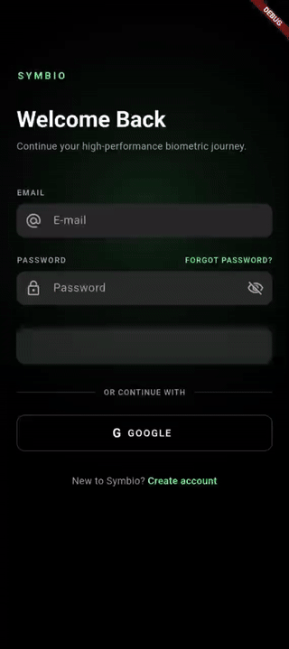

<div align="center">

# 🏋️ Fitness App

### Nutrition tracking, contract-first.

A monorepo pairing a **Flutter** mobile client with a **Django / DRF** backend. Scan barcodes, log meals, and pull food data from Open Food Facts behind a dark, glassy UI.

[](https://github.com/Drakon4ik-Coder/fitness-app/actions/workflows/backend.yml)
[](https://github.com/Drakon4ik-Coder/fitness-app/actions/workflows/mobile.yml)
[](LICENSE)

</div>

---

## 🎬 Demo

<div align="center">



</div>

---

## Highlights

- **Full auth flow** — register, JWT login/refresh, Google Sign-In, and email verification with single-use, expiring tokens.
- **Nutrition logging** — log meals, add food items, and see daily macro and calorie totals.
- **Barcode lookup** — scan a product and pull its nutrition data from Open Food Facts.
- **Smart food data** — typeahead search, on-demand ingestion, a local SQLite cache, and rate-limited OFF calls.
- **Custom UI system** — a dark "Lumina Health" theme with glassmorphism cards, glowing progress rings, and animated macro rings.
- **Hardened backend** — per-endpoint and global rate limiting, plus Cloudflare Tunnel-aware client IP resolution.
- **Contract-first API** — OpenAPI schema and Swagger UI, with CI enforcing the committed contract.

## Table of contents
- [Overview](#overview)
- [Tech stack](#tech-stack)
- [Monorepo structure](#monorepo-structure)
- [Prerequisites](#prerequisites)
- [Quickstart](#quickstart)
- [Environment variables](#environment-variables)
- [Testing and linting](#testing-and-linting)
- [API docs and contract workflow](#api-docs-and-contract-workflow)
- [CI/CD](#cicd)
- [Deployment](#deployment)
- [Roadmap](#roadmap)
- [Data sources and attribution](#data-sources-and-attribution)
- [License](#license)
- [Contributing](#contributing)

## Overview
A Flutter + Django monorepo focused on nutrition logging, food data ingestion, and a contract-first API. The backend exposes versioned REST endpoints under `/api/v1/`; the mobile app consumes them through a typed Dio client with token refresh and offline-friendly local caching.

See [`docs/ARCHITECTURE.md`](docs/ARCHITECTURE.md) for design details and [`docs/ROADMAP.md`](docs/ROADMAP.md) for planned work.

## Tech stack
| Layer | Technologies |
| --- | --- |
| **Mobile** | Flutter, Dart, Riverpod, GoRouter, Dio, sqflite, Google Sign-In |
| **Backend** | Python 3.12, Django 5.2, Django REST Framework, SimpleJWT, drf-spectacular |
| **Infra** | Postgres 16, Redis 7, Docker Compose, Cloudflare Tunnel, Render |
| **Tooling** | Poetry, Ruff, mypy, pytest, Dart analyzer, Flutter test |

## Monorepo structure
```text
.
├─ apps/
│  ├─ backend/        # Django + DRF API
│  │  ├─ accounts/    # Auth: register, JWT, Google login, email verification
│  │  ├─ foods/       # Food search, OFF ingestion, image uploads
│  │  ├─ nutrition/   # Meal entries + daily totals
│  │  ├─ nutrients/   # Nutrient registry
│  │  └─ preferences/ # User preferences
│  └─ mobile/         # Flutter app (auth, nutrition, barcode flows)
├─ contracts/
│  └─ openapi.yaml    # Generated API contract (CI-enforced)
└─ docs/              # Architecture, development, roadmap, release
```

## Prerequisites
- Docker + Docker Compose plugin (for local services).
- Python 3.12.
- Poetry.
- Flutter SDK (stable channel).

For local CI and prerequisites, also see [`docs/DEVELOPMENT.md`](docs/DEVELOPMENT.md).

## Quickstart

**Backend** (Docker Compose):
```bash
cp apps/backend/.env.example apps/backend/.env
make up
make migrate
```
Backend listens on `http://localhost:8080`.

**Mobile**:
```bash
cd apps/mobile
flutter pub get
flutter run --dart-define=API_BASE_URL=http://localhost:8080
```
> **Android emulator note:** use `http://10.0.2.2:8080` instead of `localhost`.

## Environment variables

**Backend** (`apps/backend/.env`, see `apps/backend/.env.example`):

| Variable | Required | Notes |
| --- | --- | --- |
| `DJANGO_SECRET_KEY` | Yes (prod) | Development default is in `config/settings/base.py`. |
| `DATABASE_URL` | Yes | Compose uses `postgres://postgres:postgres@db:5432/fitness`. |
| `DEBUG` | No | Defaults to `true` in `.env.example`. |
| `ALLOWED_HOSTS` | No | Used by base/prod settings. |
| `DJANGO_SETTINGS_MODULE` | No | `config.settings.local` (dev), `config.settings.prod` (prod), `config.settings.test` (tests). |
| `CSRF_TRUSTED_ORIGINS` | No | Prod only, set in `config/settings/prod.py`. |
| `SENTRY_DSN` | No | Optional error reporting. |
| `OFF_USER_AGENT` | No | Open Food Facts user-agent string for image fetches. |

**Mobile** (Dart defines from `apps/mobile/lib/core/environment.dart`):

| Variable | Required | Notes |
| --- | --- | --- |
| `APP_ENV` | No | `local` (default), `staging`, `prod`. |
| `API_BASE_URL` | No | Overrides the base URL (defaults to `http://localhost:8000`). |
| `OFF_USER_AGENT` | No | Defaults to `FitnessApp/1.0`. |
| `OFF_COUNTRY` | No | Defaults to `en:united-kingdom`. |

> Do not commit secrets. Keep local `.env` files out of version control and use `.env.example` as a template.

## Testing and linting
All checks (mirrors CI and includes the OpenAPI contract check):
```bash
make check
```

| Command | What it runs |
| --- | --- |
| `make test` | Test suites |
| `make lint` | Lint + typecheck |
| `make fmt` | Formatting checks |
| `make check-backend` | Backend-only checks |
| `make check-mobile` | Mobile-only checks |

## API docs and contract workflow
- **Swagger UI:** `http://localhost:8080/api/docs/`
- **OpenAPI schema:** `http://localhost:8080/api/schema/`
- **Contract file:** `contracts/openapi.yaml`

Regenerate the contract:
```bash
make backend-contract
# or directly:
cd apps/backend && ./scripts/export_openapi.sh
```
CI expects `contracts/openapi.yaml` to be up to date.

## CI/CD
- **Pull requests:** Backend CI and Mobile CI always run; steps are gated by relevant file changes. Meta CI always runs.
- **Push to `main`:** full backend + mobile + meta checks run every time.
- **Nightly:** full pipeline runs on a scheduled workflow.
- **Manual runs:** `workflow_dispatch` is enabled for all workflows.

## Deployment
- `render.yaml` defines a Render web service that builds `apps/backend/Dockerfile`.
- `apps/backend/entrypoint.sh` runs migrations and starts Gunicorn on `$PORT` (default 8000).
- Health check endpoint: `/health/`.
- Production env vars typically include `DJANGO_SETTINGS_MODULE=config.settings.prod`, `DJANGO_SECRET_KEY`, `DATABASE_URL`, and `CSRF_TRUSTED_ORIGINS`. `SENTRY_DSN` is optional.
- `MEDIA_ROOT` is local disk (`apps/backend/media`); plan for persistent storage in production if using uploads.

See [`docs/RELEASE.md`](docs/RELEASE.md) for tagging and release notes guidance.

## Roadmap
Already shipped: auth, nutrition logging, barcode lookup, and food ingestion. Planned next (see [`docs/ROADMAP.md`](docs/ROADMAP.md)):
- Recipes and meal planning.
- Workouts and training logs.
- Inventory and pantry management.
- Analytics and insights.
- Community features.

## Data sources and attribution
Powered by **Open Food Facts**.

- Open Food Facts data is published under the Open Database License (ODbL). See https://world.openfoodfacts.org/data.
- Product images are typically under Creative Commons Attribution-ShareAlike (CC BY-SA). See https://world.openfoodfacts.org/terms-of-use.

When distributing the app or datasets, keep attribution and license notices intact.

## License
Licensed under the Apache License 2.0. See [`LICENSE`](LICENSE) and [`NOTICE`](NOTICE) for details.

## Contributing
- Use feature branches and keep PRs small.
- Run `make check` before opening a PR.
- If the API changes, update `contracts/openapi.yaml`.
- Optional pre-push hook: `./scripts/install-githooks.sh`.
- Backend pre-commit config is in `apps/backend/.pre-commit-config.yaml` if you use `pre-commit`.
